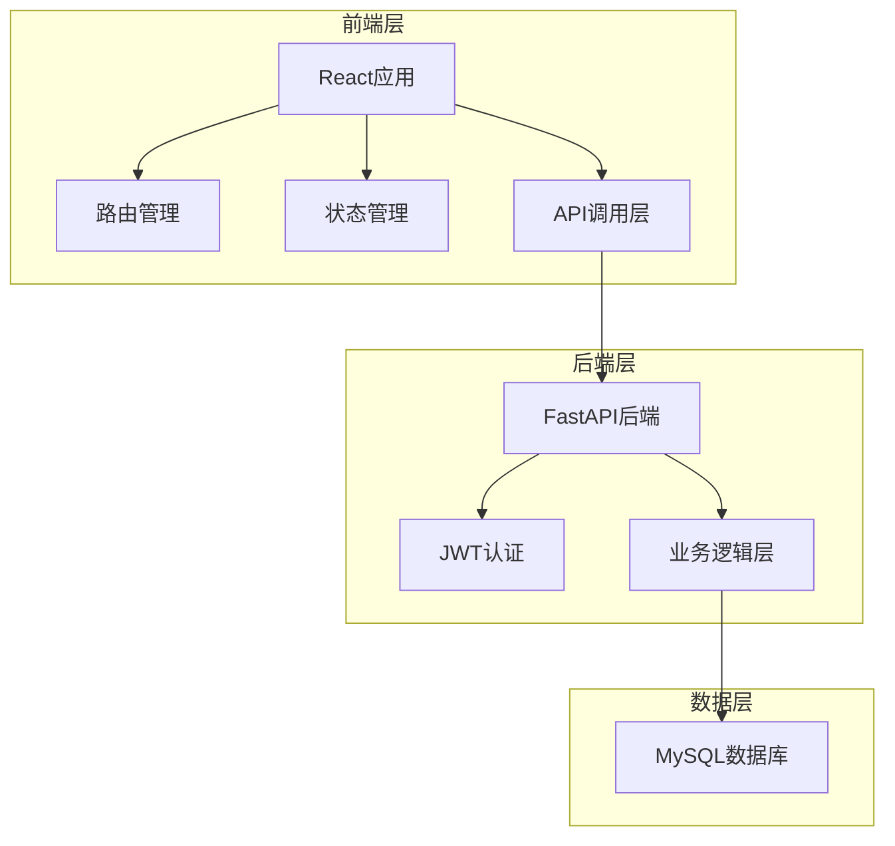
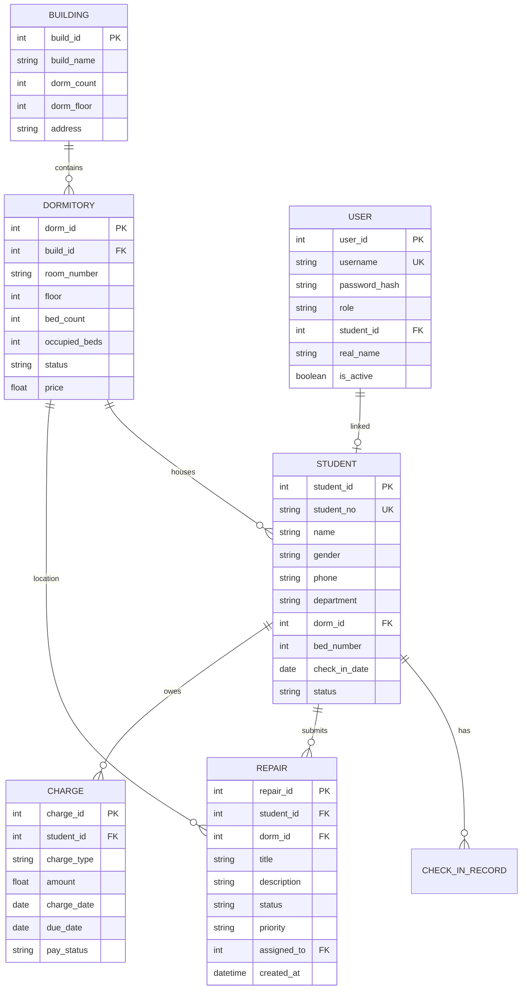

# 宿舍管理系统 Web 前端 - 技术架构文档

## 1. 架构设计



## 2. 技术栈说明

### 2.1 前端技术栈
- **核心框架**: React 18.2.0
- **构建工具**: Vite 4.5.0
- **样式方案**: Tailwind CSS 3.4.0
- **路由管理**: React Router 6.22.0
- **状态管理**: React Query (TanStack Query) 5.17.0
- **表单处理**: React Hook Form 7.50.0 + Zod 3.22.0
- **UI组件库**: Headless UI 1.7.0 (自定义样式)
- **图表库**: Chart.js 4.4.0 或 ECharts 5.4.0
- **图标库**: Heroicons 2.1.0
- **工具库**: Axios 1.6.0, Day.js 1.11.0

### 2.2 后端技术栈（已实现）
- **Web框架**: FastAPI 0.115.6
- **ORM**: SQLAlchemy 2.0.36
- **数据库**: MySQL 8.4.10
- **认证**: JWT (python-jose 3.3.0)
- **密码加密**: bcrypt (passlib 1.7.4)

### 2.3 开发工具
- **包管理器**: npm / yarn
- **代码规范**: ESLint + Prettier
- **类型检查**: TypeScript 5.3.0
- **测试工具**: Vitest + React Testing Library

## 3. 路由定义

| 路由路径 | 页面名称 | 功能说明 |
|---------|----------|----------|
| `/login` | 登录页 | 用户认证，角色选择 |
| `/register` | 注册页 | 学生用户注册 |
| `/dashboard` | 仪表盘首页 | 数据统计，快捷操作，公告展示 |
| `/dormitories` | 宿舍管理页 | 楼栋列表，房间详情，状态管理 |
| `/dormitories/:id` | 房间详情页 | 床位分布，入住信息 |
| `/students` | 学生管理页 | 学生列表，入住办理，退宿处理 |
| `/students/checkin` | 入住办理页 | 入住流程表单 |
| `/repairs` | 报修中心页 | 工单列表，新建工单 |
| `/repairs/:id` | 工单详情页 | 工单详情，处理进度 |
| `/charges` | 费用管理页 | 费用账单，缴费记录 |
| `/announcements` | 公告通知页 | 公告列表，详情查看 |
| `/profile` | 个人中心页 | 个人信息，设置 |
| `*` | 404页 | 页面不存在提示 |

## 4. API 定义

### 4.1 认证相关 API
```typescript
// 登录请求
interface LoginRequest {
  username: string;
  password: string;
}

// 登录响应
interface LoginResponse {
  access_token: string;
  token_type: string;
  user: {
    user_id: number;
    username: string;
    role: 'admin' | 'student' | 'repairman';
    real_name: string;
  };
}

// API 路径
POST /api/v1/auth/login
POST /api/v1/auth/register
```

### 4.2 宿舍管理 API
```typescript
// 宿舍楼信息
interface Building {
  build_id: number;
  build_name: string;
  dorm_count: number;
  dorm_floor: number;
  address: string;
}

// 宿舍房间信息（含楼栋）
interface DormitoryWithBuilding {
  dorm_id: number;
  build_id: number;
  room_number: string;
  floor: number;
  bed_count: number;
  occupied_beds: number;
  available_beds: number;
  status: 'available' | 'full' | 'maintenance';
  price: number;
  occupancy_rate: number;
  building_name: string;
}

// API 路径
GET /api/v1/buildings
GET /api/v1/buildings/:id
POST /api/v1/buildings (管理员)
PUT /api/v1/buildings/:id (管理员)
DELETE /api/v1/buildings/:id (管理员)

GET /api/v1/dormitories?build_id=1&status=available
GET /api/v1/dormitories/:id
POST /api/v1/dormitories (管理员)
PUT /api/v1/dormitories/:id (管理员)
DELETE /api/v1/dormitories/:id (管理员)
```

### 4.3 学生管理 API
```typescript
// 学生信息（含宿舍）
interface StudentWithDormitory {
  student_id: number;
  student_no: string;
  name: string;
  gender: 'male' | 'female';
  phone: string;
  department: string;
  class_name: string;
  dorm_id: number;
  bed_number: number;
  check_in_date: string;
  status: 'living' | 'graduated' | 'leave';
  building_name: string;
  room_number: string;
}

// 入住请求
interface CheckInRequest {
  student_id: number;
  dorm_id: number;
  bed_number?: number;
}

// API 路径
GET /api/v1/students?student_no=123&name=张
GET /api/v1/students/:id
POST /api/v1/students (管理员)
PUT /api/v1/students/:id (管理员)
DELETE /api/v1/students/:id (管理员)
POST /api/v1/students/checkin (管理员)
POST /api/v1/students/checkout (管理员)
```

### 4.4 报修工单 API
```typescript
// 报修工单
interface Repair {
  repair_id: number;
  student_id: number;
  dorm_id: number;
  title: string;
  description: string;
  category: string;
  status: 'pending' | 'assigned' | 'processing' | 'completed' | 'cancelled';
  priority: 'low' | 'medium' | 'high' | 'urgent';
  assigned_to: number;
  created_at: string;
  completed_at: string;
  feedback: string;
}

// API 路径
GET /api/v1/repairs?status=pending
GET /api/v1/repairs/:id
POST /api/v1/repairs (学生)
PUT /api/v1/repairs/:id/status (维修员/管理员)
```

### 4.5 费用管理 API
```typescript
// 费用账单
interface Charge {
  charge_id: number;
  student_id: number;
  charge_type: string;
  amount: number;
  charge_date: string;
  due_date: string;
  pay_status: 'unpaid' | 'paid' | 'overdue';
  pay_date: string;
}

// API 路径
GET /api/v1/charges/me (学生)
GET /api/v1/charges/student/:id (管理员)
POST /api/v1/charges/pay/:id (学生)
```

### 4.6 公告通知 API
```typescript
// 公告
interface Announcement {
  announcement_id: number;
  title: string;
  content: string;
  category: string;
  is_top: boolean;
  status: 'draft' | 'published' | 'archived';
  publisher_id: number;
  publish_time: string;
}

// API 路径
GET /api/v1/announcements
```

## 5. 状态管理方案

### 5.1 全局状态
- **用户信息**: current_user, token, role
- **应用配置**: theme, language, layout
- **通知消息**: alerts, notifications

### 5.2 数据缓存策略
使用 React Query 进行服务器状态管理：
- **缓存时间**: 5分钟
- **后台刷新**: 窗口聚焦时自动刷新
- **错误重试**: 失败后自动重试3次
- **乐观更新**: 表单提交时乐观更新UI

## 6. 数据模型定义

### 6.1 ER 图（数据库关系）


## 7. 项目初始化流程

### 7.1 开发环境设置
```bash
# 1. 创建前端项目
cd /home/smile/github_project/DormNest
npm create vite@latest frontend -- --template react-ts

# 2. 安装依赖
cd frontend
npm install react-router-dom @tanstack/react-query
npm install react-hook-form zod @hookform/resolvers
npm install axios dayjs
npm install @headlessui/react heroicons
npm install chart.js react-chartjs-2
npm install -D tailwindcss postcss autoprefixer
npm install -D typescript @types/react @types/react-dom
npm install -D eslint prettier

# 3. 配置 Tailwind CSS
npm tailwindcss init -p
```

### 7.2 项目结构
```
frontend/
├── src/
│   ├── components/          # 可复用组件
│   │   ├── ui/              # 基础UI组件
│   │   ├── layout/          # 布局组件
│   │   └── features/        # 功能组件
│   ├── pages/               # 页面组件
│   │   ├── Login.tsx
│   │   ├── Dashboard.tsx
│   │   ├── Dormitories.tsx
│   │   ├── Students.tsx
│   │   ├── Repairs.tsx
│   │   ├── Charges.tsx
│   │   └── Announcements.tsx
│   ├── hooks/               # 自定义hooks
│   ├── api/                 # API调用
│   ├── utils/               # 工具函数
│   ├── types/               # TypeScript类型定义
│   ├── context/             # Context providers
│   ├── App.tsx              # 主应用组件
│   ├── main.tsx             # 应用入口
│   └── index.css            # 全局样式
├── public/
├── index.html
├── vite.config.ts
├── tailwind.config.js
├── tsconfig.json
└── package.json
```

## 8. 性能优化策略

### 8.1 加载性能
- **路由懒加载**: 使用 React.lazy 进行路由懒加载
- **代码分割**: 按功能模块进行代码分割
- **图片优化**: 使用懒加载和压缩图片
- **CDN加速**: 静态资源使用CDN

### 8.2 运行性能
- **虚拟列表**: 大数据列表使用虚拟滚动
- **防抖节流**: 搜索输入使用防抖
- **缓存策略**: React Query智能缓存
- **动画优化**: CSS动画优先，避免JavaScript动画

### 8.3 用户体验
- **骨架屏**: 数据加载时显示骨架屏
- **渐进加载**: 图片渐进加载效果
- **离线缓存**: Service Worker缓存关键资源
- **错误边界**: React错误边界处理